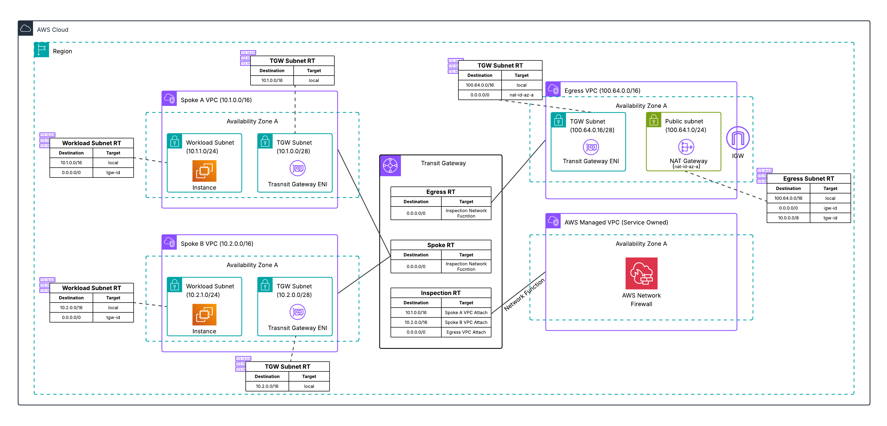
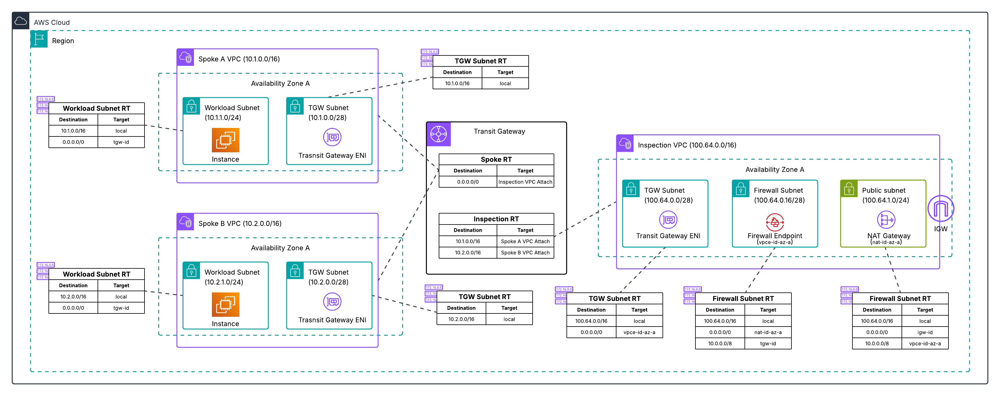
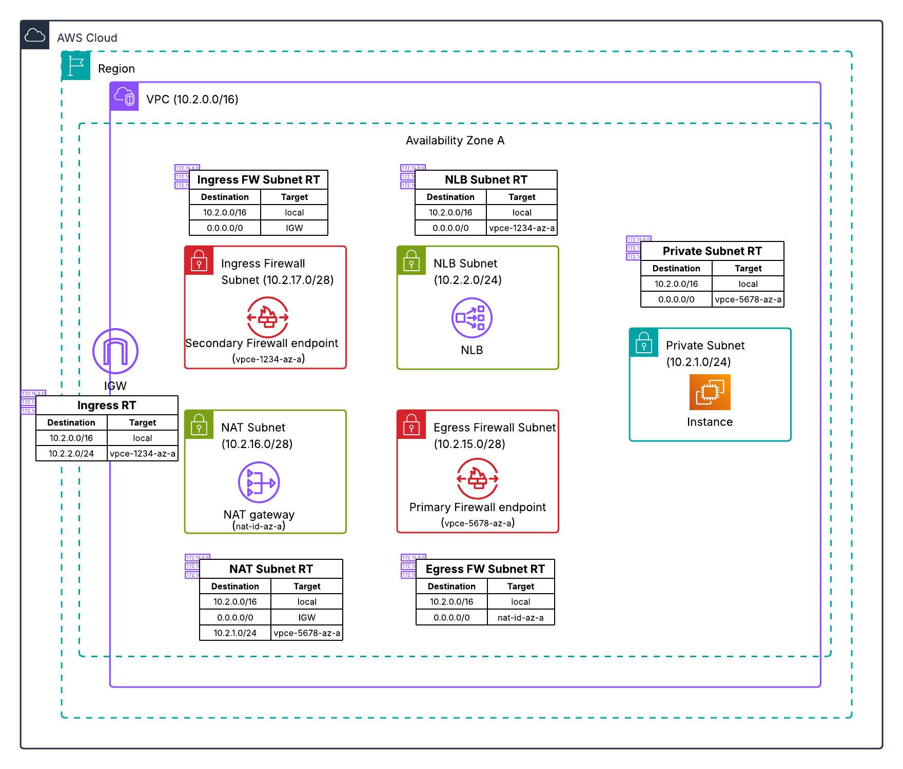
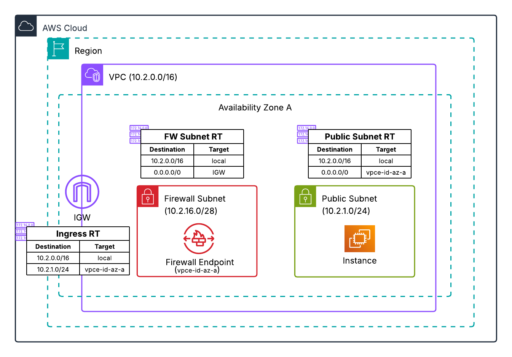
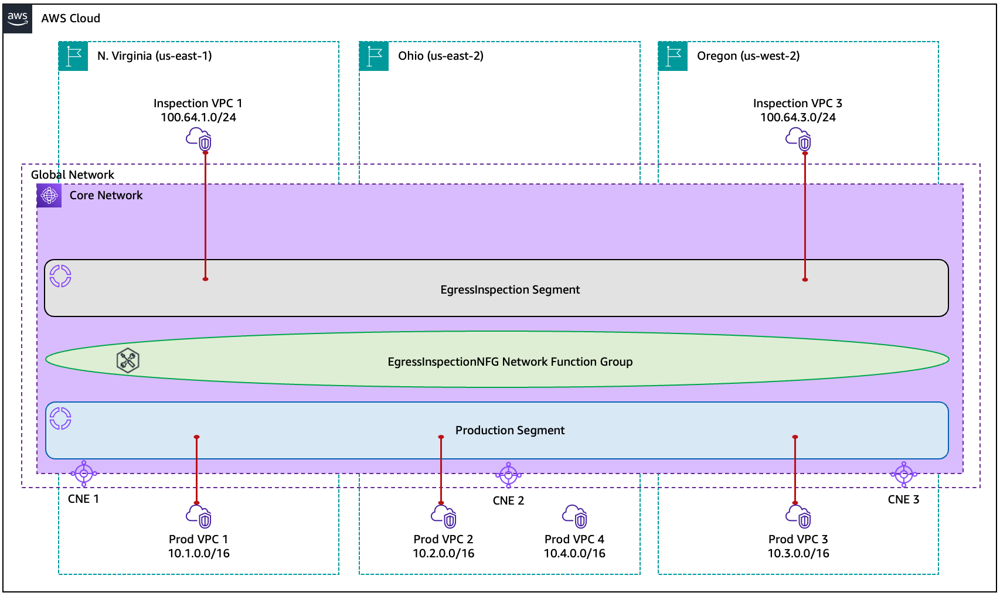

# AWS Network Firewall Terraform Templates

Sample Terraform templates demonstrating [AWS Network Firewall](https://aws.amazon.com/network-firewall/) routing architectures and deployment models.

> **Looking for CloudFormation?** These same architectures are available as CloudFormation templates: [aws-networkfirewall-cfn-templates](https://github.com/aws-samples/aws-networkfirewall-cfn-templates)

## Available Architectures

### Centralized Architecture

Uses AWS Transit Gateway for centralized inspection of East-West (VPC-to-VPC) and egress (internet-bound) traffic.

#### [Transit Gateway-Attached Firewall](transit_gateway_attached_firewall/)

Attaches AWS Network Firewall directly to [Transit Gateway as a native attachment](https://docs.aws.amazon.com/network-firewall/latest/developerguide/tgw-firewall.html). AWS creates and manages the inspection VPC transparently, removing the need to create and manage your own.

**Note:** Transit Gateway-Attached Firewall is required to use [Transit Gateway Flexible Cost Allocation](https://docs.aws.amazon.com/vpc/latest/tgw/metering-policy.html) for chargebacks. The other centralized deployment models in this repository do not support this feature.

| Template | Use Case |
|----------|----------|
| [Manual Deployment](transit_gateway_attached_firewall/manual_deployment/) | Learning and hands-on configuration |
| [Pre-Deployed](transit_gateway_attached_firewall/pre_deployed/) | Automated provisioning |

#### [Inspection VPC Model](centralized_architecture/)

Routes traffic through a dedicated inspection VPC containing the firewall endpoints.

| Template | Use Case |
|----------|----------|
| [Single AZ](centralized_architecture/single_az/) | Single availability zone |
| [Two AZ](centralized_architecture/two_az/) | High availability across two AZs |

### Distributed Architecture

Deploys AWS Network Firewall into each VPC individually. No Transit Gateway required—each VPC is protected independently.

#### [Multiple VPC Endpoint Associations](multi_endpoint/)

Leverages the [VPC Endpoint Association feature](https://docs.aws.amazon.com/network-firewall/latest/developerguide/creating-vpc-endpoint-association.html) to deploy multiple firewall endpoints per availability zone to maintain source IP visibility when inspecting both ingress and egress traffic with the same firewall.

#### [Single Endpoint](distributed-architecture/)

Single firewall endpoint per availability zone with options for combined or separate ingress/egress inspection.

| Configuration | Single AZ | Two AZ |
|--------------|-----------|--------|
| Combined Ingress/Egress Firewall | [Template](distributed-architecture/single_az/combined-ingress-and-egress-firewall/) | [Template](distributed-architecture/two_az/combined-ingress-and-egress-firewall/) |
| Separate Ingress/Egress Firewalls | [Template](distributed-architecture/single_az/separate-ingress-and-egress-firewall/) | [Template](distributed-architecture/two_az/separate-ingress-and-egress-firewall/) |

### [Egress Inspection with AWS Cloud WAN](outbound_inspection_with_cloudwan/)

Workshop-based templates for deploying egress inspection using AWS Cloud WAN and AWS Network Firewall across multiple regions.

### [CloudWatch Dashboard](cloudwatch_dashboard/)

Terraform templates for creating a comprehensive monitoring dashboard for AWS Network Firewall metrics and logs.

## License

This sample code is made available under the MIT-0 license. See the [LICENSE](LICENSE) file.

## Additional Resources

- [AWS Network Firewall Best Practices Guide](https://aws.github.io/aws-security-services-best-practices/guides/network-firewall/)
- [Deployment Models for AWS Network Firewall](https://aws.amazon.com/blogs/networking-and-content-delivery/deployment-models-for-aws-network-firewall/)
- [Deployment Models for AWS Network Firewall - Part 2](https://aws.amazon.com/blogs/networking-and-content-delivery/deployment-models-for-aws-network-firewall-with-vpc-routing-enhancements/)
