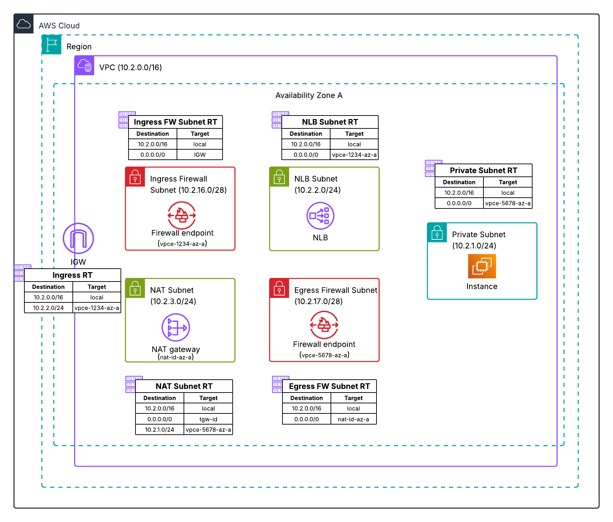

# Distributed Architecture - Single AZ Separate Firewalls

This Terraform configuration deploys AWS Network Firewall in a distributed model with separate ingress and egress firewalls in one Availability Zone.

## Architecture



### Traffic Flow

- **Ingress:** Internet → IGW → Ingress Firewall → NLB → Private EC2 Instances
- **Egress:** Private EC2 Instances → Egress Firewall → NAT Gateway → IGW → Internet

## Resources Created

- VPC with private, NLB, NAT, and firewall subnets
- Internet Gateway and NAT Gateway
- Ingress Network Firewall
- Egress Network Firewall
- Network Load Balancer (internet-facing)
- Two private EC2 instances with Apache web server
- VPC Endpoints for SSM
- CloudWatch Log Groups for both firewalls

## Prerequisites

- Terraform >= 1.0.0
- AWS CLI configured with appropriate credentials
- AWS provider ~> 6.31

## Deployment

```bash
terraform init
terraform plan
terraform apply
```

## Variables

| Name | Description | Default |
|------|-------------|---------|
| aws_region | AWS Region for deployment | us-east-1 |
| availability_zone | Availability Zone for deployment | us-east-1a |
| vpc_cidr | CIDR block for the VPC | 10.2.0.0/16 |
| private_subnet_cidr | CIDR block for the private subnet | 10.2.1.0/24 |
| nlb_subnet_cidr | CIDR block for the NLB subnet | 10.2.2.0/24 |
| nat_subnet_cidr | CIDR block for the NAT Gateway subnet | 10.2.3.0/24 |
| project_name | Name prefix for all resources | nfw-1az-dual |

## Testing

1. Access the NLB DNS name in a browser to test ingress
2. Connect to instances via SSM and test egress: `curl checkip.amazonaws.com`
3. Review firewall logs in CloudWatch

## Cleanup

```bash
terraform destroy
```
