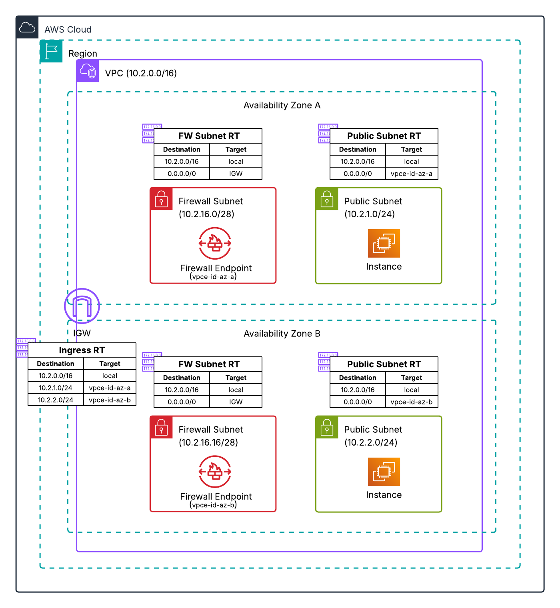

# Distributed Architecture - Two AZ Combined Firewall

This Terraform configuration deploys AWS Network Firewall in a distributed model with a single firewall handling both ingress and egress traffic across two Availability Zones for high availability.

## Architecture



### Traffic Flow

- **Egress:** Test Instance → Firewall (same AZ) → Internet Gateway → Internet
- **Ingress:** Internet → Internet Gateway → Firewall (same AZ) → Test Instance

## Resources Created

- VPC with public and firewall subnets in two AZs
- Internet Gateway
- AWS Network Firewall with endpoints in both AZs
- Two test EC2 instances (one per AZ) with SSM access
- VPC Endpoints for SSM in both AZs
- CloudWatch Log Groups for firewall flow and alert logs
- Route tables with AZ-aware routing through firewall

## Prerequisites

- Terraform >= 1.0.0
- AWS CLI configured with appropriate credentials
- AWS provider ~> 6.31

## Deployment

```bash
terraform init
terraform plan
terraform apply
```

## Variables

| Name | Description | Default |
|------|-------------|---------|
| aws_region | AWS Region for deployment | us-east-1 |
| availability_zone_1 | First Availability Zone | us-east-1a |
| availability_zone_2 | Second Availability Zone | us-east-1b |
| vpc_cidr | CIDR block for the VPC | 10.2.0.0/16 |
| public_subnet_1_cidr | CIDR for public subnet 1 | 10.2.1.0/24 |
| public_subnet_2_cidr | CIDR for public subnet 2 | 10.2.2.0/24 |
| project_name | Name prefix for all resources | nfw-distributed-2az |

## Testing

1. Connect to test instances using SSM Session Manager
2. Test egress connectivity: `curl checkip.amazonaws.com`
3. Review firewall logs in CloudWatch

## Cleanup

```bash
terraform destroy
```
