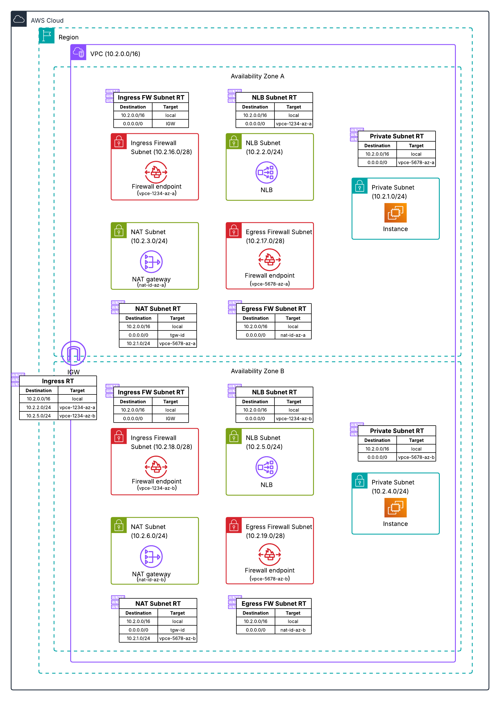

# Distributed Architecture - Two AZ Separate Firewalls

This Terraform configuration deploys AWS Network Firewall in a distributed model with separate ingress and egress firewalls across two Availability Zones for high availability.

## Architecture



### Traffic Flow

- **Ingress:** Internet → IGW → Ingress Firewall (AZ1/AZ2) → NLB → Private EC2 Instances
- **Egress:** Private EC2 Instances → Egress Firewall (AZ1/AZ2) → NAT Gateway → IGW → Internet

## Resources Created

- VPC with private, NLB, NAT, and firewall subnets in two AZs
- Internet Gateway and NAT Gateways (one per AZ)
- Ingress Network Firewall with endpoints in both AZs
- Egress Network Firewall with endpoints in both AZs
- Network Load Balancer (internet-facing, multi-AZ)
- Four private EC2 instances (two per AZ) with Apache web server
- VPC Endpoints for SSM in both AZs
- CloudWatch Log Groups for both firewalls

## Prerequisites

- Terraform >= 1.0.0
- AWS CLI configured with appropriate credentials
- AWS provider ~> 6.31

## Deployment

```bash
terraform init
terraform plan
terraform apply
```

## Variables

| Name | Description | Default |
|------|-------------|---------|
| aws_region | AWS Region for deployment | us-east-1 |
| availability_zone_1 | First Availability Zone | us-east-1a |
| availability_zone_2 | Second Availability Zone | us-east-1b |
| vpc_cidr | CIDR block for the VPC | 10.2.0.0/16 |
| private_subnet_az1_cidr | CIDR for private subnet AZ1 | 10.2.1.0/24 |
| private_subnet_az2_cidr | CIDR for private subnet AZ2 | 10.2.4.0/24 |
| project_name | Name prefix for all resources | nfw-2az-dual |

## Testing

1. Access the NLB DNS name in a browser to test ingress
2. Connect to instances via SSM and test egress: `curl checkip.amazonaws.com`
3. Review firewall logs in CloudWatch

## Cleanup

```bash
terraform destroy
```
