# Manual Deployment - Transit Gateway-Attached Firewall

This guide walks you through deploying AWS Network Firewall with Transit Gateway native attachment using a hands-on approach. You'll first deploy the base infrastructure with Terraform, then manually configure the firewall attachment and routing to enable traffic inspection.


## Architecture Overview

### Base Infrastructure (Before Firewall Configuration)

The Terraform configuration deploys the foundational infrastructure without firewall inspection:

**Initial Traffic Flows:**
- **East-West Traffic (Spoke to Spoke):** Traffic flows directly between spoke VPCs through Transit Gateway without inspection
  - Spoke A → TGW (Spoke Route Table) → Spoke B
- **Egress Traffic (Internet-bound):** Traffic flows from spoke VPCs to egress VPC for internet access without inspection
  - Spoke → TGW (Spoke Route Table) → Egress VPC → NAT Gateway → Internet

**Resources Created:**
- Transit Gateway with two route tables (Spoke and Egress)
- Two Spoke VPCs (Spoke A and Spoke B) with EC2 instances
- Egress VPC with NAT Gateway and Internet Gateway
- CloudWatch Log Groups for firewall logging (pre-created for later use)

### Final Architecture (After Manual Configuration)

After completing the manual steps, traffic will flow through the firewall for inspection:

**Updated Traffic Flows:**
- **East-West Traffic:** Spoke A → TGW (Spoke Route Table) → Network Firewall → TGW (Spoke Route Table) → Spoke B
- **Egress Traffic:** Spoke → TGW (Spoke Route Table) → Network Firewall → TGW (Inspection Route Table) → Egress VPC → NAT Gateway → Internet

For a fully automated deployment, see the [Pre-Deployed](../pre_deployed/) option.

---

## Deployment Instructions

## Phase 1: Deploy Base Infrastructure

### Step 1: Deploy with Terraform

Deploy the base infrastructure that creates the Transit Gateway, spoke VPCs, and egress VPC.

```bash
terraform init
terraform plan
terraform apply
```

---

## Phase 2: Configure Network Firewall

### Step 2: Create AWS Network Firewall

Navigate to the AWS Network Firewall console to create the firewall with Transit Gateway attachment.

1. Open the **VPC Console** → **Network Firewall** → **Firewalls**
2. Click **Create firewall** (e.g., `tgw-attached-firewall`)
3. Enter a **Firewall name**
4. Click **Next**

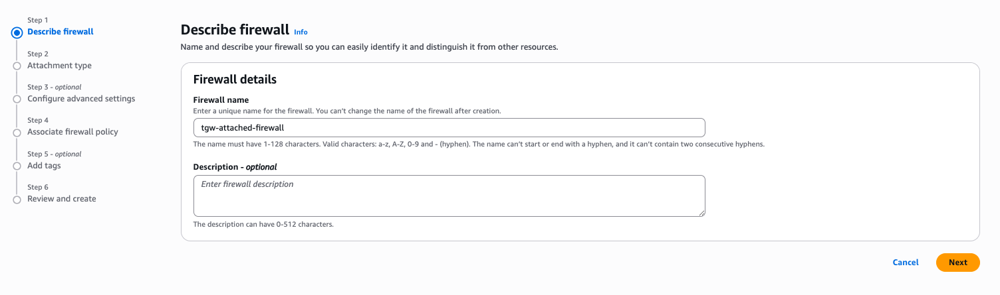

---

### Step 3: Configure Transit Gateway Attachment

Configure the firewall to attach directly to the Transit Gateway as a network function.

1. Under **Attachment details**, select **Transit Gateway**
2. From the dropdown, choose the Transit Gateway created by Terraform
3. Under **Associated Availability Zone**, select the same AZ you specified in variables
4. Click **Next**

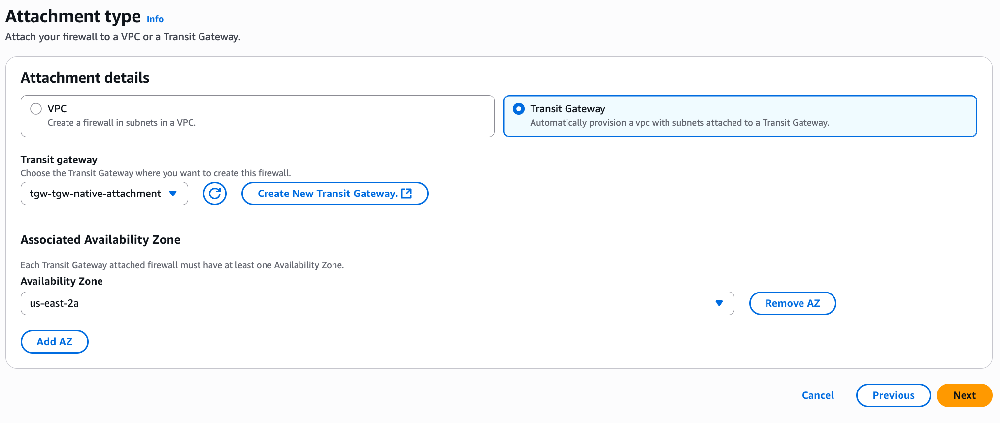

---

### Step 4: Configure Logging

Enable logging to capture traffic flow and alert data.

1. Enable **Alert logs**
   - **Destination type:** CloudWatch Logs
   - **Log group:** Select the pre-created log group (`/nfw/alert-logs`)
2. Enable **Flow logs**
   - **Destination type:** CloudWatch Logs
   - **Log group:** Select the pre-created log group (`/nfw/flow-logs`)
3. Click **Next**

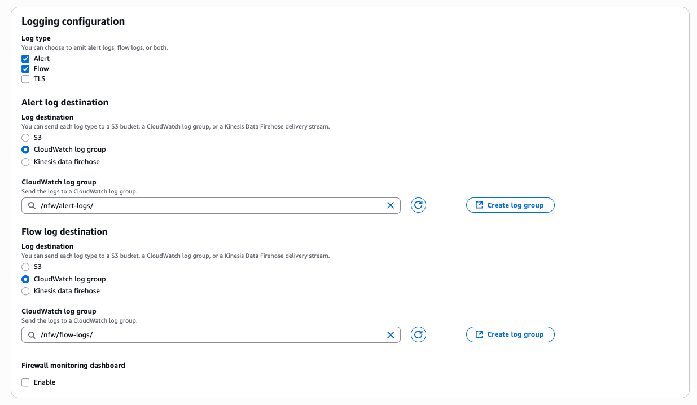

---

### Step 5: Create Firewall Policy

Create a basic firewall policy to control traffic inspection behavior.

1. Select **Create and associate a new firewall policy**
2. Enter a **Policy name** (e.g., `inspection-policy`)
3. Configure policy settings:
   - **Rule evaluation order:** Strict order (default)
   - **Drop action:** None
   - **Alert action:** Alert established (default)
4. Progress to the last screen and click **Create firewall**

Wait for the firewall to reach `Ready` status (this may take 5-10 minutes).

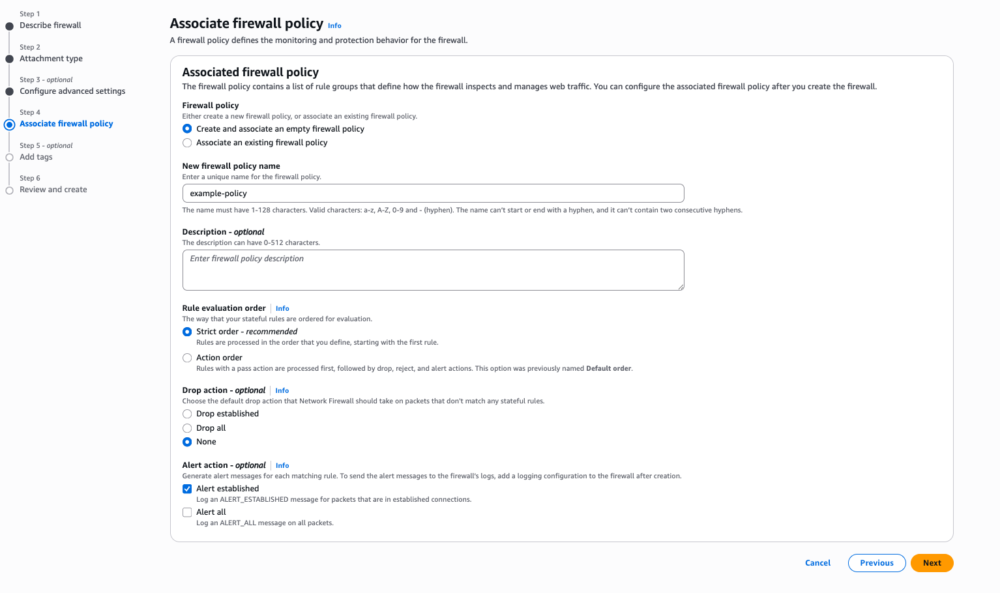
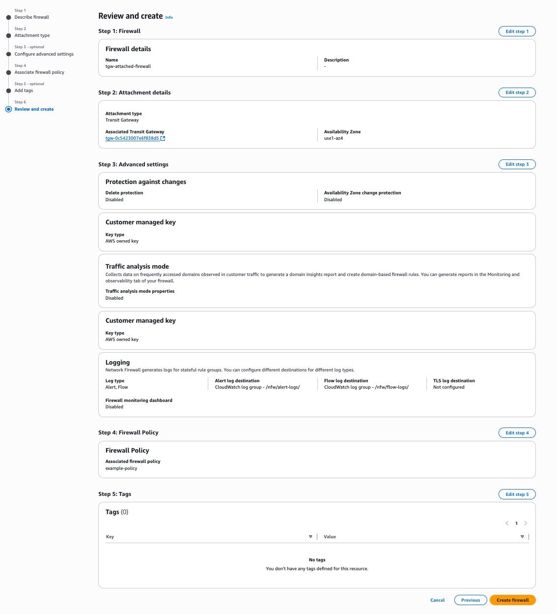

---

## Phase 3: Configure Transit Gateway Routing

### Step 6: Create Inspection Route Table

Create a new Transit Gateway route table for the firewall attachment.

1. Navigate to **VPC Console** → **Transit Gateways** → **Transit gateway route tables**
2. Click **Create transit gateway route table**
3. Configure:
   - **Name:** Enter a name (e.g., `inspection-route-table`)
   - **Transit Gateway:** Select the existing Transit Gateway
4. Click **Create transit gateway route table**

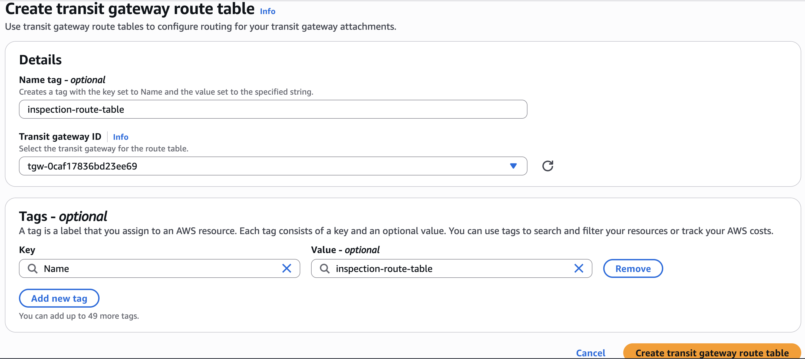

---

### Step 7: Configure Route Propagations

Enable route propagations so the inspection route table learns spoke VPC routes.

1. Select the **inspection-route-table**
2. Navigate to the **Propagations** tab
3. Click **Create propagation**
4. Select **Spoke A VPC attachment** and click **Create propagation**
5. Repeat for **Spoke B VPC attachment**

This allows the firewall to route traffic back to the correct spoke VPC after inspection.

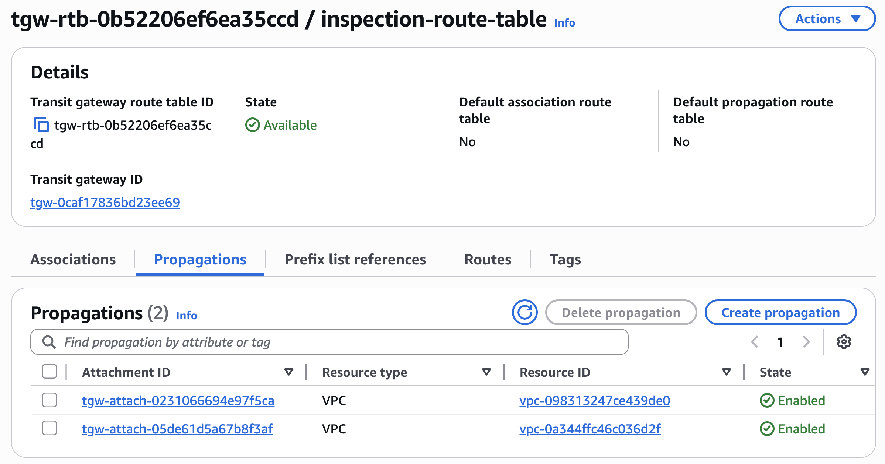

---

### Step 8: Create Default Route to Egress VPC

Configure the inspection route table to send internet-bound traffic to the egress VPC.

1. Within the **inspection-route-table**, navigate to the **Routes** tab
2. Click **Create static route**
3. Configure:
   - **CIDR:** `0.0.0.0/0`
   - **Attachment:** Select the **Egress VPC attachment**
4. Click **Create static route**

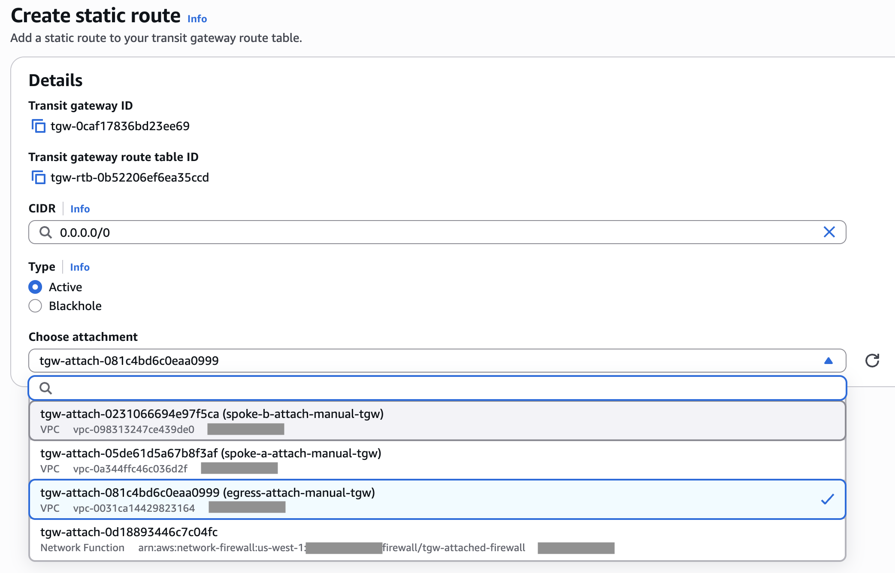

---

### Step 9: Associate Firewall Attachment to Inspection Route Table

Associate the Network Firewall attachment with the inspection route table.

1. Within the **inspection-route-table**, navigate to the **Associations** tab
2. Click **Create association**
3. Select the **Network Firewall attachment** (shown as Network Function)
4. Click **Create association**

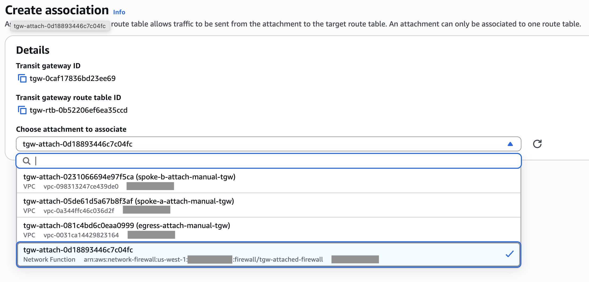

---

### Step 10: Remove Spoke Propagations from Spoke Route Table

Remove spoke VPC propagations from the spoke route table to prevent direct routing between spokes.

1. Select the **spoke-route-table**
2. Navigate to the **Propagations** tab
3. Delete the propagation for **Spoke A VPC attachment**
4. Delete the propagation for **Spoke B VPC attachment**

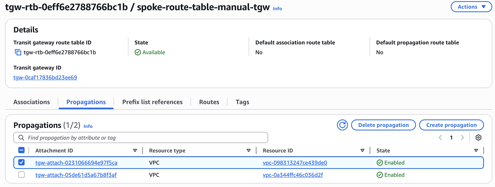

---

### Step 11: Update Spoke Route Table Default Route

Redirect spoke VPC traffic to flow through the firewall instead of directly to the egress VPC.

1. Within the **spoke-route-table**, navigate to the **Routes** tab
2. Locate the existing default route (`0.0.0.0/0` pointing to Egress VPC)
3. Select the route, then click **Actions** → **Replace static route**
4. Configure:
   - **Attachment:** Select the **Network Firewall attachment** (Network Function)
5. Click **Replace static route**

This ensures all spoke traffic is inspected by the firewall before reaching its destination.

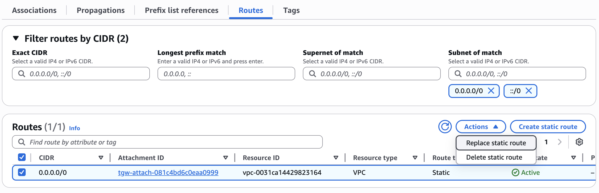
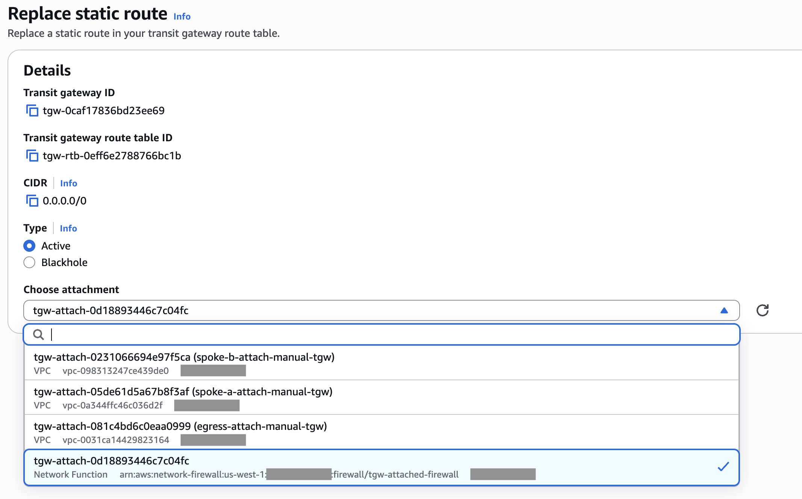

---

### Step 12: Configure Egress Route Table

Update the egress route table to send return traffic through the firewall.

1. Select the **egress-route-table**
2. Navigate to the **Propagations** tab
3. Delete all existing propagations (Spoke A and Spoke B attachments)
4. Navigate to the **Routes** tab
5. Click **Create static route**
6. Configure:
   - **CIDR:** `0.0.0.0/0`
   - **Attachment:** Select the **Network Firewall attachment** (Network Function)
7. Click **Create static route**

This ensures return traffic from the egress VPC flows through the firewall for stateful inspection.

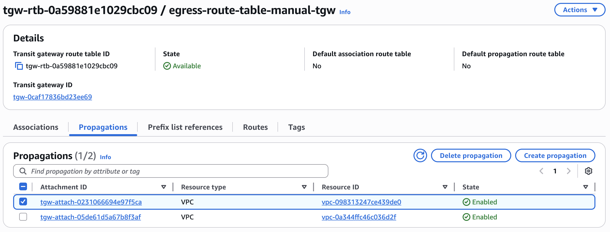
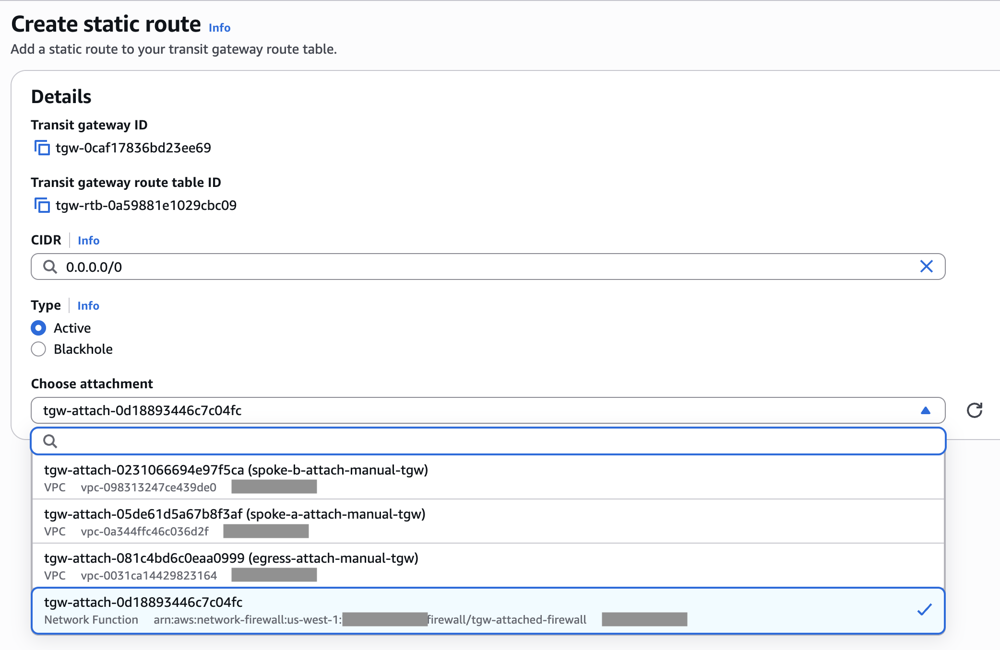

---

## Verification

After completing all steps, verify the configuration:

1. **Test East-West Connectivity:**
   - Connect to Spoke A EC2 instance via AWS Systems Manager Session Manager
   - Ping the Spoke B EC2 instance private IP
   - Traffic should flow through the firewall

2. **Test Egress Connectivity:**
   - From either spoke EC2 instance, test internet connectivity (e.g., `ping 8.8.8.8`)
   - Traffic should flow through the firewall to the egress VPC

3. **Review Firewall Logs:**
   - Navigate to **CloudWatch Logs**
   - Check the flow and alert log groups for traffic inspection events

## Traffic Flow Summary

**Before Configuration:**
- East-West: Spoke → TGW → Spoke (no inspection)
- Egress: Spoke → TGW → Egress VPC → Internet (no inspection)

**After Configuration:**
- East-West: Spoke → TGW → Firewall → TGW → Spoke (inspected)
- Egress: Spoke → TGW → Firewall → TGW → Egress VPC → Internet (inspected)

---

## Variables

| Name | Description | Default |
|------|-------------|---------|
| aws_region | AWS region for deployment | us-east-1 |
| project_name | Project name for resource naming | tgw-attached-fw |
| availability_zone | Availability Zone for deployment | us-east-1a |
| spoke_a_vpc_cidr | CIDR for Spoke A VPC | 10.1.0.0/16 |
| spoke_b_vpc_cidr | CIDR for Spoke B VPC | 10.2.0.0/16 |
| egress_vpc_cidr | CIDR for Egress VPC | 100.64.0.0/16 |
| log_retention_days | CloudWatch log retention | 7 |

## Outputs

| Name | Description |
|------|-------------|
| transit_gateway_id | Transit Gateway ID for firewall attachment |
| spoke_a_instance_id | Spoke A EC2 Instance ID for testing |
| spoke_a_security_group_id | Spoke A Security Group ID |
| spoke_b_security_group_id | Spoke B Security Group ID |
| egress_tgw_route_table_id | Egress TGW Subnet Route Table ID |
| egress_public_route_table_id | Egress Public Subnet Route Table ID |
| tgw_egress_route_table_id | TGW Egress Route Table ID |
| egress_vpc_attachment_id | Egress VPC TGW Attachment ID |

## Additional Resources

- [AWS Network Firewall Documentation](https://docs.aws.amazon.com/network-firewall/)
- [AWS Network Firewall Best Practices Guide](https://aws.github.io/aws-security-services-best-practices/guides/network-firewall/)
- [Transit Gateway-Attached Firewalls](https://docs.aws.amazon.com/network-firewall/latest/developerguide/tgw-firewall.html)
- [Pre-Deployed Architecture](../pre_deployed/) - Fully automated deployment option
